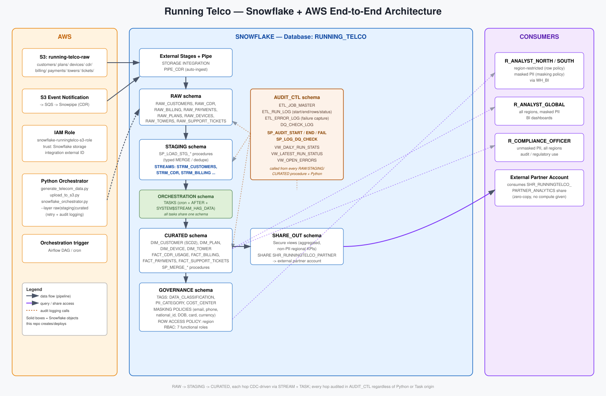

# Running Telco — Snowflake + AWS End-to-End Data Platform

A complete, deployable reference implementation of a telecom data platform:
S3 landing → Snowflake RAW → STAGING (Streams/CDC) → CURATED (dimensional
model) → Governance (tags, masking, row access) → Secure Data Sharing, with
a full **Audit & Control framework** capturing daily run statistics and
failures, driven by Snowflake Tasks and a Python orchestrator (runnable
standalone or via the included Airflow DAG).

> This is a synthetic reference company ("Running Telco", database
> `RUNNING_TELCO`) with a realistic schema and realistic data volumes — not
> a live production account. Every object, procedure, and script is written
> to actually run; point it at your own Snowflake account + AWS account and
> it works end-to-end. Swap `generate_telecom_data.py` for your real source
> extracts and nothing downstream needs to change.



---

## 1. What's in the repo

```
running-telco-snowflake-aws/
├── sql/
│   ├── 00_setup/               databases, schemas, warehouses, RBAC roles, file formats, S3 stages
│   ├── 01_raw_layer/           RAW.* tables (1:1 with source feeds) + Snowpipe (deployed after RAW tables exist)
│   ├── 02_staging_layer/       STAGING.* typed tables + STREAMS (CDC)
│   ├── 03_curated_layer/       CURATED.* dimensional model (SCD2 dim + facts) + BI views
│   ├── 04_procedures/          stored procedures: RAW->STAGING, STAGING->CURATED (stream-consuming)
│   ├── 05_tasks/                TASK DAG (all tasks live in ORCHESTRATION schema - see note below)
│   ├── 06_governance/           TAGS, column MASKING POLICIES, ROW ACCESS POLICY, grants
│   ├── 07_data_sharing/         secure views + outbound SHARE to an external partner account
│   ├── 08_audit_control/        AUDIT_CTL schema: job master, run log, error log, DQ log, audit procedures
│   └── 09_validation/           ERROR_SCHEMA: RAW-layer data quality validation (row count
│                                 reconciliation, not-null, date format, accepted values) - see section 4.1
├── sql_consolidated/
│   └── deploy_all.sql           all 18 files above, concatenated into one script with section
│                                 markers - includes the "no ACCOUNTADMIN" deployment pattern
│                                 (see section 9 below). Useful for one-shot deploys or environments
│                                 like the one this variant was built for.
├── python/
│   ├── config/config.py         central config (env-var driven) + per-feed column registry
│   ├── ingestion/
│   │   ├── generate_telecom_data.py   realistic synthetic source data generator
│   │   └── upload_to_s3.py            lands files into S3 under the right prefixes
│   ├── orchestration/
│   │   └── snowflake_orchestrator.py  the Python half of the audit & control framework (--layer raw|staging|curated|all)
│   └── requirements.txt / .env.example
├── airflow/dags/
│   └── running_telco_pipeline_dag.py  Airflow DAG wrapping the full manual walkthrough
├── data_samples/                real generated CSVs (customers, plans, devices, cdr, billing,
│                                 payments, towers, support_tickets) - ready to upload as-is
├── diagrams/architecture.svg
├── deploy.sh                    deploys all SQL in the correct dependency order
└── README.md                    this file
```

## 2. Data model (telecom domain)

**RAW → STAGING → CURATED**, one schema per layer, in a single database `RUNNING_TELCO`.

| Feed | Grain | Notes |
|---|---|---|
| `customers` | 1 row / customer | SCD2 in CURATED (`DIM_CUSTOMER`) — address/plan/status history preserved |
| `plans` | 1 row / plan | product catalog |
| `devices` | 1 row / device | IMEI registry, linked to customer |
| `cdr` | 1 row / call-sms-data session | highest volume feed, append-only, hourly/Snowpipe |
| `billing` | 1 row / invoice | monthly |
| `payments` | 1 row / payment | linked to invoice |
| `towers` | 1 row / cell tower | network reference data |
| `support_tickets` | 1 row / ticket | customer care |

`CURATED.VW_CUSTOMER_MONTHLY_SUMMARY` joins usage + billing + payments per
customer per billing period — the main BI-facing view.

## 3. Snowflake functionality covered

| Capability | Where |
|---|---|
| External stages + Storage Integration (S3) | `sql/00_setup/03_file_formats_stages.sql` |
| Snowpipe auto-ingest (CDR) | `sql/01_raw_layer/02_snowpipe.sql` (deployed after RAW tables exist - `PIPE_CDR`'s `COPY INTO` target must already exist) |
| Stored procedures (SQL scripting, `EXCEPTION` blocks) | `sql/04_procedures/` |
| Streams (CDC) | `sql/02_staging_layer/tables_staging.sql` |
| Tasks (cron root tasks + `AFTER` + `WHEN SYSTEM$STREAM_HAS_DATA`, all in one `ORCHESTRATION` schema) | `sql/05_tasks/task_tree.sql` |
| Tagging (`DATA_CLASSIFICATION`, `PII_CATEGORY`, `COST_CENTER`) | `sql/06_governance/01_tags.sql` |
| Column-level dynamic data masking | `sql/06_governance/02_masking_policies.sql` |
| Row-level access policy (region segregation) | `sql/06_governance/03_row_access_policies.sql` |
| RBAC (7 functional roles, with full `CREATE <object>` grants) | `sql/00_setup/02_warehouses_roles.sql` |
| Secure Data Sharing (outbound `SHARE`) | `sql/07_data_sharing/01_secure_views_and_share.sql` |
| Audit & Control framework | `sql/08_audit_control/` + `python/orchestration/` |
| RAW layer data quality validation (`ERROR_SCHEMA`) | `sql/09_validation/` + `python/orchestration/` |
| Orchestration (Airflow) | `airflow/dags/running_telco_pipeline_dag.py` |

## 4. The Audit & Control framework

`AUDIT_CTL` is the backbone every other schema calls into:

- **`ETL_JOB_MASTER`** — registry of every job (name, layer, source/target, schedule)
- **`ETL_RUN_LOG`** — one row per execution: start/end time, status, rows
  read/inserted/updated/deleted/rejected, duration, warehouse, who triggered it
- **`ETL_ERROR_LOG`** — every exception, linked back to `run_id`, with
  `SQLSTATE`, message, JSON context, and severity
- **`DQ_CHECK_LOG`** — data-quality rule results (null-key checks, etc.)
- **`SP_AUDIT_START` / `SP_AUDIT_END` / `SP_AUDIT_FAIL` / `SP_LOG_DQ_CHECK`** —
  the four calls every load/merge procedure makes; also called directly from
  Python for the S3→RAW `COPY INTO` step, so **one unified audit trail**
  covers both SQL-Task-driven and Python-driven steps. Every parameter
  reference inside these procedures' SQL bodies is `:`-prefixed (Snowflake
  Scripting bind-variable syntax) — a bare reference raises "invalid
  identifier."
- **`VW_DAILY_RUN_STATS`, `VW_LATEST_RUN_STATUS`, `VW_OPEN_ERRORS`** — the
  views a dashboard or Slack/email alert would query.

Every procedure follows the same pattern:

```sql
v_run_id := (CALL AUDIT_CTL.SP_AUDIT_START('JOB_NAME', 'TASK'));
-- ... do the MERGE/INSERT/COPY ...
CALL AUDIT_CTL.SP_AUDIT_END(:v_run_id, rows_read, rows_ins, rows_upd, rows_del, rows_rejected, 'comment');
EXCEPTION
  WHEN OTHER THEN
    CALL AUDIT_CTL.SP_AUDIT_FAIL(:v_run_id, 'SQL_ERROR', :sqlcode, :sqlerrm, OBJECT_CONSTRUCT(...));
    RAISE;
```

## 4.1 RAW layer validation (`ERROR_SCHEMA`)

Runs right after RAW load, before STAGING load - `sql/09_validation/` (deployed
as files 9-10 of 18; `deploy.sh` and `sql_consolidated/deploy_all.sql` both
place it right after `08_audit_control`). One `ERROR_SCHEMA.SP_VALIDATE_RAW_<feed>()`
procedure per feed, same shape as `STAGING.SP_LOAD_STG_<feed>()`, checking:

- **Row count reconciliation** - for every source file already landed in a
  RAW table, re-counts the same file directly off the external stage
  (`SELECT COUNT(*) FROM @stage/<file> (FILE_FORMAT => ...)`, relying on
  `PURGE = FALSE`) and compares to the row count landed in the RAW table for
  that file → `ERROR_SCHEMA.SRC_TARGET_COUNT_LOG`.
- **Not-null validation** on every column already treated as a required key
  elsewhere in the pipeline (customer_id, plan_id, cdr_id, invoice_id, etc).
- **Date/timestamp format validation** on every date-like column, using the
  same `TRY_TO_DATE` / `TRY_TO_TIMESTAMP_NTZ` the STAGING load procedures use
  - so a value that would silently become `NULL` downstream is instead
  caught and logged with the original string.
- **Accepted values validation** on every enum-like column (`account_status`,
  `call_type`, `payment_status`, `region`, ...) against the domain the
  synthetic source system produces (see `generate_telecom_data.py`) - edit
  the `IN (...)` lists in `02_sp_validate_raw.sql` for your real domain.

Every failing **rule** (pass/fail counts) goes to
`ERROR_SCHEMA.VALIDATION_RUN_SUMMARY`; every failing **record** (the full RAW
row as VARIANT, for triage/reprocessing) goes to
`ERROR_SCHEMA.VALIDATION_ERROR_LOG`. Validation is observability, not a gate
- it doesn't block or delete anything in RAW, and `SP_LOAD_STG_*` keeps doing
its own independent defensive filtering exactly as before. Query:

```sql
SELECT * FROM ERROR_SCHEMA.VW_VALIDATION_SUMMARY_TODAY;
SELECT * FROM ERROR_SCHEMA.VW_OPEN_VALIDATION_ERRORS;
SELECT * FROM ERROR_SCHEMA.VW_COUNT_RECONCILIATION_MISMATCHES;
```

Run it standalone (`CALL ERROR_SCHEMA.SP_VALIDATE_RAW_CUSTOMERS();`) or via
the orchestrator's own layer, right after `raw`:

```bash
python orchestration/snowflake_orchestrator.py --layer raw      --feeds all
python orchestration/snowflake_orchestrator.py --layer validate --feeds all
python orchestration/snowflake_orchestrator.py --layer staging  --feeds all
```

`ERROR_SCHEMA.VALIDATION_RULE_REGISTRY` is a human-readable reference of every
rule enforced - it documents the rules, it does not drive them (the checks
are plain SQL in `02_sp_validate_raw.sql`, matching how every other procedure
in this repo is written, not a dynamic rule engine). Keep the two in sync by
hand when you add or change a rule.

## 5. Deployment

### Prereqs
- A Snowflake account with `ACCOUNTADMIN` (or `SYSADMIN`+`SECURITYADMIN`) access for first-time setup
- An AWS account with permission to create an S3 bucket + IAM role
- `snowsql` CLI configured (`~/.snowsql/config`), Python 3.10+

### Step 1 — AWS: create the S3 bucket and IAM role
```bash
aws s3 mb s3://running-telco-raw
# Create the IAM role referenced in sql/00_setup/03_file_formats_stages.sql
# (STORAGE_AWS_ROLE_ARN) - trust policy is completed in step 3 below.
```

### Step 2 — Deploy Snowflake objects
```bash
chmod +x deploy.sh
./deploy.sh <your_snowsql_connection_name>
```
This runs, in order: databases/schemas → warehouses/RBAC (including the
`CREATE <object>` grants each role needs, not just `USAGE`) → file
formats/stages → RAW tables → Snowpipe → STAGING tables/streams → CURATED
tables → AUDIT_CTL → audit procedures → ERROR_SCHEMA tables → RAW validation
procedures → load/merge procedures → governance (tags/masking/row policy) →
data sharing → tasks (created suspended, then resumed at the end of the
script). `deploy.sh` runs every file with
`-o echo=true`, so if any statement fails, the SQL text printed immediately
before the error tells you exactly which statement it was.

> **Common first-run error:** `Insufficient privileges to operate on schema
> 'RAW'... must have CREATE FILE FORMAT granted on SCHEMA RUNNING_TELCO.RAW.`
> This means `02_warehouses_roles.sql` wasn't run (or wasn't run by a role
> with rights to grant to `R_DATA_ENGINEER`) before the file-formats/stages
> script. Run it as `ACCOUNTADMIN`/`SECURITYADMIN` first — it grants
> `CREATE TABLE/VIEW/FILE FORMAT/STAGE/PIPE/STREAM/TASK/PROCEDURE/...` on
> every schema `R_DATA_ENGINEER` and `R_DATA_GOVERNANCE` need to build in.
>
> **Another common error:** `Cannot have predecessor <task> from a different
> schema.` Snowflake requires every task chained together with `AFTER` in
> one DAG to live in the *same* schema — a task can `CALL` a procedure in
> any schema, but the `TASK` object itself can't have a predecessor outside
> its own schema. That's why every `TASK` lives in a dedicated
> `ORCHESTRATION` schema (see `sql/00_setup/01_databases_schemas.sql`)
> instead of splitting root tasks into `STAGING` and merge tasks into
> `CURATED`.
>
> **`Grant not executed: Insufficient privileges` on `GRANT ROLE X TO ROLE
> SYSADMIN` or `GRANT CREATE INTEGRATION/SHARE ON ACCOUNT ...`:** these are
> account-level operations that specifically require `ACCOUNTADMIN` (or a
> role holding that exact privilege `WITH GRANT OPTION`) — ordinary
> `MANAGE GRANTS` does not cover redistributing account-level privileges,
> only object-level ones. If your organization has no `ACCOUNTADMIN` user
> available at all, see **Section 9** below for the alternative pattern.

### Step 3 — Complete the S3 ↔ Snowflake trust relationship
```sql
DESC INTEGRATION S3_RUNNINGTELCO_INT;
-- copy STORAGE_AWS_IAM_USER_ARN and STORAGE_AWS_EXTERNAL_ID into the
-- AWS IAM role's trust policy, then:
SHOW PIPES;
-- copy notification_channel (SQS ARN) into the S3 bucket's event notification config
```

### Step 4 — Generate & land data, run the pipeline
```bash
cd python
pip install -r requirements.txt
cp .env.example .env   # fill in your Snowflake/AWS credentials

python ingestion/generate_telecom_data.py --out ./data_out --customers 5000 --cdr-per-day 20000 --days 3
python ingestion/upload_to_s3.py --local-dir ./data_out --bucket running-telco-raw

# The four layers are independent invocations - nothing auto-chains between
# them, matching how the Snowflake TASK DAG separates raw/staging/curated.
python orchestration/snowflake_orchestrator.py --layer raw      --feeds all
python orchestration/snowflake_orchestrator.py --layer validate --feeds all
python orchestration/snowflake_orchestrator.py --layer staging  --feeds all
python orchestration/snowflake_orchestrator.py --layer curated

# Convenience for local/manual testing only - runs all four layers in one
# process, in order. In production, schedule each layer separately instead
# (e.g. separate Airflow tasks/cron entries per layer, or leave curated to
# the Snowflake TASKs entirely - see Step 5).
python orchestration/snowflake_orchestrator.py --layer all --feeds all
```

The orchestrator will log to stdout, `orchestrator.log`, and — most
importantly — into `AUDIT_CTL.ETL_RUN_LOG` / `ETL_ERROR_LOG` in Snowflake,
then print a daily summary.

### Step 5 — Let the Tasks take over
After the first manual run above, `sql/05_tasks/task_tree.sql` already
resumed the full Task DAG — daily feeds run at 06:00–09:00 UTC, CDR runs
hourly, and each `STAGING→CURATED` task fires automatically only when its
Stream has data (`SYSTEM$STREAM_HAS_DATA`), so idle warehouses never spin up
for a no-op.

## 6. Running it via Airflow instead

`airflow/dags/running_telco_pipeline_dag.py` wraps Step 4 above into five
Airflow tasks, chained: `generate_telecom_data → upload_to_s3 →
load_raw_layer → load_staging_layer → merge_curated_layer`.

```bash
cp airflow/dags/running_telco_pipeline_dag.py $AIRFLOW_HOME/dags/
airflow variables set running_telco_repo_dir   /path/to/running-telco-snowflake-aws
airflow variables set running_telco_python_bin /path/to/venv/bin/python
```
Make sure `python/.env` exists with real credentials — each task sources it
before running its script. Full details, including why `schedule=None` by
default and the production-shape note (splitting cadences per feed), are in
the DAG file's own docstring.

## 7. Operating the pipeline

```sql
-- Is everything healthy right now?
SELECT * FROM AUDIT_CTL.VW_LATEST_RUN_STATUS ORDER BY job_name;

-- Today's stats (rows in/out, failures, avg duration)
SELECT * FROM AUDIT_CTL.VW_DAILY_RUN_STATS WHERE run_date = CURRENT_DATE();

-- Anything broken and unresolved?
SELECT * FROM AUDIT_CTL.VW_OPEN_ERRORS;

-- RAW layer data quality - today's rule pass/fail counts, open record-level
-- failures, and any source-file-vs-table count mismatches (see section 4.1)
SELECT * FROM ERROR_SCHEMA.VW_VALIDATION_SUMMARY_TODAY;
SELECT * FROM ERROR_SCHEMA.VW_OPEN_VALIDATION_ERRORS;
SELECT * FROM ERROR_SCHEMA.VW_COUNT_RECONCILIATION_MISMATCHES;

-- Snowflake's own task run history
SELECT * FROM TABLE(INFORMATION_SCHEMA.TASK_HISTORY())
ORDER BY scheduled_time DESC LIMIT 50;
```

## 8. Governance quick reference

- **Tags**: `GOVERNANCE.DATA_CLASSIFICATION` (`PII`/`FINANCIAL`/`CONFIDENTIAL`/...),
  `GOVERNANCE.PII_CATEGORY` (`NAME`/`NATIONAL_ID`/`CONTACT_INFO`/...) applied to
  every sensitive column in `CURATED`.
- **Masking**: `R_COMPLIANCE_OFFICER` and `R_TELECOM_ADMIN` see raw values;
  every other role sees masked email/phone/national_id/DOB/card/address.
- **Row access**: `R_ANALYST_NORTH` only sees `region = 'NORTH'`,
  `R_ANALYST_SOUTH` only `'SOUTH'` — driven by the maintainable
  `GOVERNANCE.ROLE_REGION_MAP` table, not hardcoded logic.
- **Sharing**: `SHR_RUNNINGTELCO_PARTNER_ANALYTICS` exposes three
  aggregated, non-PII secure views (`SHARE_OUT.*`) to an external account
  with zero data copy and zero compute given away.

## 9. Deploying without ACCOUNTADMIN access

Some organizations run Snowflake with no one ever using `ACCOUNTADMIN`
day-to-day — instead a single "lead" custom role is granted `SYSADMIN` +
`SECURITYADMIN` membership and does everything else. Two statements in this
repo genuinely cannot be delegated that way, because Snowflake restricts
redistributing **account-level** privileges (as opposed to privileges on an
owned object) to `ACCOUNTADMIN` or a role holding that exact privilege
`WITH GRANT OPTION` — `MANAGE GRANTS` does not override this for
account-level privileges specifically:

```sql
GRANT CREATE INTEGRATION ON ACCOUNT TO ROLE R_DATA_ENGINEER;  -- sql/00_setup/02_warehouses_roles.sql
GRANT CREATE SHARE       ON ACCOUNT TO ROLE R_TELECOM_ADMIN;  -- same file
```

If your lead role already holds `CREATE INTEGRATION` directly (check with
`SHOW GRANTS TO ROLE <your_lead_role>;`), the storage integration can be
created directly by that role instead of redistributing the privilege — see
`sql_consolidated/deploy_all.sql` for the full worked pattern (search for
"LEAD_ROLE" in that file and substitute your own role name). In short:

1. Skip both `GRANT ... ON ACCOUNT` lines above.
2. Create `S3_RUNNINGTELCO_INT` as your lead role (not `R_DATA_ENGINEER`),
   then `GRANT USAGE ON INTEGRATION S3_RUNNINGTELCO_INT TO ROLE
   R_DATA_ENGINEER;` — an ordinary object-level grant on something your
   lead role owns, fully within its existing power.
3. If your lead role does **not** hold `CREATE SHARE` at all (check the same
   `SHOW GRANTS` output — it's not a default privilege of either `SYSADMIN`
   or `SECURITYADMIN`), outbound Secure Data Sharing genuinely cannot be
   provisioned without a one-time `ACCOUNTADMIN` touch. The secure views in
   `sql/07_data_sharing/01_secure_views_and_share.sql` still deploy fine and
   are still queryable directly by `R_DATA_ENGINEER` — only the final
   `CREATE SHARE` object is blocked. Worth raising with whoever owns the
   account: at least one `ACCOUNTADMIN`-capable user existing (even a
   rarely-used, heavily-audited "break-glass" one) is how Snowflake expects
   this class of operation to be handled.

## 10. CI/CD and new-developer onboarding

- **First time setting this up on a new machine (from a blank WSL/Linux box
  with nothing installed)?** See `docs/DEVELOPER_ONBOARDING.md` — full
  walkthrough from OS packages through Git/AWS/Snowflake credentials to your
  first local pipeline run, plus how CI/CD actually promotes changes to
  shared environments.
- `.github/workflows/ci.yml` — runs on every PR: `ci/lint_checks.sh` (static
  regression checks — see below) + Airflow DAG parse validation. No
  credentials needed.
- `.github/workflows/deploy.yml` — runs on merge to `main`: deploys `sql/`
  to Snowflake via `ci/deploy_snowflake.py` (key-pair auth), and syncs
  `airflow/dags/` + `python/requirements.txt` to the S3 bucket Amazon MWAA
  (or an equivalent self-hosted setup) watches — the standard way DAGs
  actually reach a managed Airflow environment, not manual file copying.
- `ci/lint_checks.sh` is worth reading on its own: every check in it exists
  because that exact bug was hit during this project's development (multi-
  role grants, tasks split across schemas, missing `:`-prefixed bind
  variables in Snowflake Scripting, hardcoded `COPY INTO` column
  positions) — it's a real regression suite, not a placeholder.

## 11. Extending this to a real company

1. Point `python/ingestion` at your actual CRM/mediation/billing extracts
   instead of `generate_telecom_data.py` — keep the same CSV column
   contract (or add a new RAW table + stage + load procedure for a
   different format/JSON feed).
2. Replace the `<AWS_ACCOUNT_ID>` / bucket names / partner account locator
   placeholders with your real values.
3. Add regions/roles to `GOVERNANCE.ROLE_REGION_MAP` as the org grows.
4. Wire `python/orchestration/snowflake_orchestrator.py` into your real
   scheduler (Airflow DAG included, or Step Functions/ECS scheduled task)
   instead of running it by hand — schedule `--layer raw` and `--layer
   staging` as separate tasks per feed cadence (e.g. CDR hourly, everything
   else daily), and either schedule `--layer curated` on its own cadence
   too, or skip it entirely and let the Snowflake TASK DAG (`sql/05_tasks`)
   handle STAGING→CURATED automatically.
5. Rename the database again any time by repeating the find/replace list at
   the top of section 1 above.
